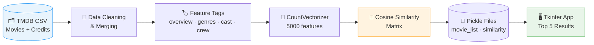

<div align="center">

# 🎬 Movie Recommendation System

### *Discover your next favorite film — powered by Machine Learning*

**End-to-end content-based recommender built from raw TMDB data to a polished desktop app.**

<br/>


<br/>

👤 **Himanshu Gautam** · Portfolio Project · ML · Data Engineering · App Development

</div>

---

## 📋 Table of Contents

- [Overview](#-overview)
- [Key Highlights](#-key-highlights)
- [Live Demo Flow](#-live-demo-flow)
- [Architecture](#-architecture)
- [Tech Stack](#-tech-stack)
- [Project Structure](#-project-structure)
- [Quick Start](#-quick-start)
- [Skills Demonstrated](#-skills-demonstrated)
- [Author](#-author)

---

## 🎯 Overview

This project solves a classic recommendation problem: **given a movie you love, what should you watch next?**

Instead of user ratings, the system uses **content-based filtering** — analyzing genres, keywords, cast, crew, and plot summaries to find movies with similar characteristics. The result is a fast, offline desktop app that returns **5 personalized recommendations** in milliseconds.

---

## ✨ Key Highlights

<table>
<tr>
<td width="50%">

### 🧠 Smart Recommendations
Content-based ML engine using **5,000 text features** and **cosine similarity** across ~4,800 movies.

</td>
<td width="50%">

### ⚡ Instant Results
Precomputed similarity matrix loaded at startup — **no retraining** needed at inference time.

</td>
</tr>
<tr>
<td width="50%">

### 🖥️ Desktop GUI
Clean **Tkinter** interface with input validation, error messages, and gradient styling.

</td>
<td width="50%">

### 📦 Production-Ready Artifacts
Model serialized with **Pickle**; similarity matrix **auto-downloads** on first run via `gdown`.

</td>
</tr>
</table>

---

## 🎥 Live Demo Flow

```
┌─────────────────────────────────────────┐
│   🎬 Movie Recommendation System        │
├─────────────────────────────────────────┤
│  Enter a Movie Name:                    │
│  ┌─────────────────────────────────┐    │
│  │ Gandhi                          │    │
│  └─────────────────────────────────┘    │
│         [ Recommend ]                   │
├─────────────────────────────────────────┤
│  📌 Top 5 Recommendations:              │
│  • Gandhi, My Father                    │
│  • The Wind That Shakes the Barley      │
│  • A Passage to India                   │
│  • Guiana 1838                          │
│  • Ramanujan                            │
└─────────────────────────────────────────┘
```

> 💡 Recommendations are theme-aware — biographical and historical dramas cluster together, not random titles.

---

## 🏗 Architecture



| Step | What Happens |
| :---: | --- |
| **1** | Merge movie metadata and credits datasets on title |
| **2** | Parse nested JSON — extract genres, keywords, top 3 cast, director |
| **3** | Build a unified `tags` string per movie from all text features |
| **4** | Vectorize with `CountVectorizer` and compute pairwise cosine similarity |
| **5** | Export artifacts and serve recommendations through the GUI |

---

## 🛠 Tech Stack

| Layer | Technologies |
| :--- | :--- |
| **Core** | `Python 3` · `NumPy` · `Pandas` |
| **Machine Learning** | `scikit-learn` — `CountVectorizer`, `cosine_similarity` |
| **Interface** | `Tkinter` — desktop GUI with event-driven design |
| **Workflow** | `Jupyter Notebook` — EDA, training pipeline, model export |
| **Deployment** | `Pickle` serialization · `gdown` auto-fetch |

---

## 📁 Project Structure

```
movie-recommender/
│
├── 📓 mode1.ipynb              # ML pipeline — EDA → model → export
├── 🖥 APP.PY                    # Desktop app — load model & recommend
│
├── 🎞 tmdb_5000_movies.csv     # Source dataset (movie metadata)
├── 🎞 tmdb_5000_credits.csv    # Source dataset (cast & crew)
│
├── 📦 movie_list.pkl           # Processed movie metadata
└── 📦 similarity.pkl           # Precomputed similarity matrix
```

| File | Description |
| --- | --- |
| `mode1.ipynb` | Full pipeline — data wrangling, feature engineering, vectorization, export |
| `APP.PY` | GUI application with recommendation logic and error handling |
| `*.pkl` | Serialized model artifacts for fast, offline inference |

---

## 🚀 Quick Start

### 1️⃣ Install dependencies

```bash
pip install gdown numpy pandas scikit-learn
```

### 2️⃣ Launch the app

```bash
python APP.PY
```

### 3️⃣ Get recommendations

Type any movie title from the dataset → click **Recommend** → receive 5 similar movies instantly.

<br/>

<details>
<summary><b>🔧 Rebuild the model from scratch (optional)</b></summary>

<br/>

1. Place `tmdb_5000_movies.csv` and `tmdb_5000_credits.csv` in the project folder
2. Open `mode1.ipynb` and run all cells
3. This generates fresh `movie_list.pkl` and `similarity.pkl`

> **Note:** If `similarity.pkl` is missing, the app downloads it automatically from Google Drive on first launch. Keep `movie_list.pkl` in the same folder as `APP.PY`.

</details>

---

## 💼 Skills Demonstrated

<table>
<tr>
<td align="center">📊<br/><b>Data Engineering</b><br/>Merge · Parse JSON · Clean</td>
<td align="center">🔬<br/><b>Feature Engineering</b><br/>Text tags · Stop words</td>
<td align="center">🤖<br/><b>Machine Learning</b><br/>Vectorization · Similarity</td>
</tr>
<tr>
<td align="center">💾<br/><b>Model Deployment</b><br/>Pickle · Inference</td>
<td align="center">🎨<br/><b>UI Development</b><br/>Tkinter · UX validation</td>
<td align="center">📓<br/><b>Reproducibility</b><br/>Jupyter · End-to-end pipeline</td>
</tr>
</table>

---

<div align="center">

## 👤 Author

### Himanshu Gautam

*Building practical ML projects — from dataset to deployable application.*

<br/>

⭐ **If you found this project interesting, consider starring the repo!**

</div>
